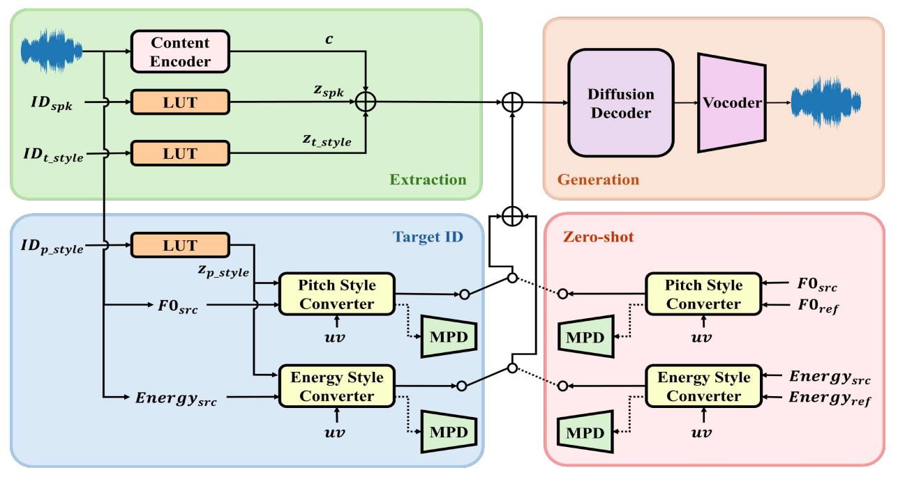

# The official implementation of VibE-SVC2

### A Vibrato Controlling Method by Predicting High-frequency F0 contour for Singing Voice Conversion (Under review)

#### Joon-Seung Choi, Dong-Min Byun, and Seong-Whan Lee

[](https://castlechoi.github.io/VibE-SVC2-demo/)



---

### Our previous work
VibE-SVC: Vibrato Extraction with High-frequency F0 Contour for Singing Voice Conversion (Interspeech 2025) [[Paper](https://arxiv.org/abs/2505.20794)] [[Demo](https://castlechoi.github.io/VibE-SVC-demo/)]


# Environment settings
## Clone repository
```
git clone https://github.com/castlechoi/VibE-SVC2
cd VibE-SVC2
```

## Install the requiements
```
pip install -r requirements.txt
```

# Download pre-trained checkpoints
Download pre-trained checkpoints to utilize our SVC framework from [drive](https://drive.google.com/drive/folders/1HJfU-MVYvlJVV1jkeXln8jJfdHAbC0N0?usp=drive_link) or [huggingface](https://huggingface.co/castlechoi/vibesvc2/tree/main). 

### Pre-trained SVC
Download and copy files checkpoints to each directory as `pretrain/{model_type}/*.pt`.
|Model type | Path | Dataset| Style | Lang.| 
|---|---|---|---|---|
| Pitch Style Conversion | `pretrain/vibe_pitch` | VocalSet | Straight<br> Vibrato | En |
| Timbre Style Conversion | `pretrain/vibe_timbre` | VocalSet | Straight<br>Belt<br>Breathy<br> Vocal Fry| En

### Style converter
Download and copy files checkpoints to each directory as `pretrain/{converter}/*.pt`.

|Cond. Type| Converter Type|Path|Dataset| Style | Lang. |
|---|---|---|---|---|---|
|Style ID | Pitch |`pretrain/style_converter/pitch_ID` |VocalSet| Straight<br>Vibrato| En | 
|Style ID | Energy|`pretrain/style_converter/energy_ID`|VocalSet| Straight<br>Vibrato| En |
|$F0_{high}$| Pitch |`pretrain/style_converter/pitch_ZS` |GTSinger| Straight<br>Vibrato| En  |
|$Energy_{high}$| Energy|`pretrain/style_convert/energy_ZS`  |GTSinger| Straight<br>Vibrato| En |

### Feature extractors
Various kinds of pre-trained feature extractors are available on [so-vits-svc](https://github.com/svc-develop-team/so-vits-svc) repository. In this work, we adopted pre-trained [HuBERT-soft](https://github.com/bshall/hubert/releases/) and [RMVPE](https://github.com/yxlllc/RMVPE/releases/) models.


# Data preparation & preprocessing

### VocalSet
Preprare the [Vocalset](https://zenodo.org/records/1193957)  dataset from Zenodo. You can download our preprocessed dataset which is segmented within 10 seconds and downsampled to 24kHz. Follow the preprocessing command line as below.

```
python preprocess_vocalset.py 
--dataset vocalset
--config_path configs/vibe_pitch.yaml
--raw_dir dataset/vocalset_raw
--data_dir dataset/vocalset_style 
--target_stats_dir configs/stats
--vocoder bigvgan_v2
--target_sr 24000
--num_processes 4
```

### GTSinger
Prepare the [GTSinger](https://huggingface.co/datasets/GTSinger/GTSinger) dataset from huggingface. You can download our preprocessed dataset which is segmented within 10 seconds and downsampled to 24kHz. Follow the preprocessing command line as below.

```
python preprocess_gtsinger.py 
--dataset gtsinger
--config_path configs/vibe_style_encoder_gtsinger.yaml
--raw_dir dataset/GTSinger
--data_dir dataset/gtsinger_en_style
--target_stats_dir configs/stats
--vocoder bigvgan_v2
--target_sr 24000
--num_processes 4
```


The preprocessing can be continued at the intermediate process stage through the `--start_stage` argument. We recommend for the `num_processes` argument to set the number of GPUs.

# Inference Arguments
#### Environment parameters
- `-m` | `--model_path` : Path to model checkpoint.
- `-c` | `--config_path` : Path to configuration.
- `-f` | `--filelist` : Path to test filelist.
- `-e` | `--exp_dir` : Path to result directory.

#### Feature extraction parameters
- `-ks` | `--k_step` : The timestep of diffusion decoder.
- `-f0p` | `--f0_predictor` : Select F0 extractor. Available on `rmvpe`,.`crepe`, `dio`.

#### Inference mode parameters
- `--infer_mode` : Select inference mode of the SVC model. `pitch`, `timbre`, and `joint` is available.
- `--target_pitch_style` : Select the pitch technique to control. `straight` and `vibrato` is available at the pre-trained model.
- `--target_timbre_style` : Select the timbre technique to control. `straight`, `belt`, `breathy`, and `vocal_fry` is available at the pre-trained model.
####
- `--rate_scale` : Select the scaling factor of the vibrato rate $\beta$.
- `--vocal_fry_enforcement` : Select the usage of vocal fry enforcement. 
####
- `--extent_scale` : Select the scaling factor of the vibrato extent $\alpha$.
- `--extent_scale_type` : Select the scaling type of the vibrato extent. Available on `global`, `inc_linear`, `dec_linear`, `sinusoidal`.


Experimental parameter
- `--multi_infer` : Convert all styles of each technique type except for source technique. If the command status is on, the result will be generated at `{env}/to_{technique}` folder.
- `-rcs` | `--recon_spk` : Reconstruct audio with the source speaker. 
- `-rct` | `--recon_tech` : Reconstruct audio with the source technique.
- `-vcr` | `--vocoded` : Generate vocoded audio.


# Inference model

### Pitch Style Conversion (Target ID)
```    
python inference_main.py 
    -m pretrain/vibe_pitch/model_200000.pt
    -c pretrain/vibe_pitch/config.yaml
    -f filelists/vocalset_pitch/test.txt 
    -s configs/stats/f0_pitch.yaml
    -f0p rmvpe 
    -e exp/pitch_style_only 
    --infer_mode pitch 
    --target_pitch_style vibrato 
    --extent_scale 1.0
    --rate_scale 1.0
```

### Pitch Style Conversion (Zero-Shot)
```
python inference_main.py 
    -m pretrain/vibe_pitch/model_200000.pt
    -c pretrain/vibe_pitch/config.yaml 
    -f filelists/vocalset_pitch/test.txt 
    -s configs/stats/f0_pitch_gtsinger.yaml
    -f0p rmvpe 
    -e exp/zeroshot_pitch_style_only 
    --infer_mode pitch 
    --target_pitch_style vibrato 
    --extent_scale 1.0
    --rate_scale 1.0
    --pitch_zeroshot
```
### Timbre Style Conversion (Target ID)
```
python inference_main.py 
    -m pretrain/vibe_timbre/model_200000.pt
    -c pretrain/vibe_timbre/config.yaml 
    -f filelists/vocalset_timbre/test.txt 
    -s configs/stats/f0_timbre.yaml
    -f0p rmvpe 
    -e exp/timbre_style_only 
    --infer_mode timbre 
    --target_timbre_style vocal_fry 
```
### Pitch & Timbre Style Conversion
Use timbre style conversion model for joint style conversion.
```
python inference_main.py 
    -m pretrain/vibe_timbre/model_200000.pt
    -c pretrain/vibe_timbre/config.yaml 
    -f filelists/vocalset_timbre/test.txt 
    -s configs/stats/f0_timbre.yaml
    -f0p rmvpe 
    -e exp/joint 
    --infer_mode joint 
    --target_pitch_style vibrato 
    --target_timbre_style breathy
    --extent_scale 1.0
    --rate_scale 1.0
```

# Training receipe

### SVC models
---

Train the diffusion decoder for **Pitch Style Conversion** task.
```
python train.py -c configs/vibe_pitch.yaml
```
Train the diffusion decoder for **Timbre Style Conversion** task.
```
python train.py -c configs/vibe_timbre.yaml
```

### Pitch Style Encoder
---
#### Pitch_ID
```
python train_style_converter.py 
    -c configs/vibe_style_encoder.yaml
    --data_dir dataset/vocalset_style
    --feature_type pitch
```
#### Pitch_ZS
```
python train_style_converter.py 
    -c configs/vibe_style_encoder.yaml
    --data_dir dataset/gtsinger_en_style
    --feature_type pitch
    --zero_shot
```
#### Energy_ID
```
python train_style_converter.py 
    -c configs/vibe_style_encoder.yaml
    --data_dir dataset/vocalset_style
    --feature_type energy
```
#### Energy_ZS
```
python train_style_converter.py 
    -c configs/vibe_style_encoder.yaml
    --data_dir dataset/gtsinger_en_style
    --feature_type energy
    --zero_shot
```


# Acknowledgements

Our codes are based on the following repos:
- [so-vits-svc](https://github.com/svc-develop-team/so-vits-svc)
- [Diffusion-SVC](https://github.com/CNChTu/Diffusion-SVC)
- [BigVGAN](https://github.com/NVIDIA/BigVGAN)

